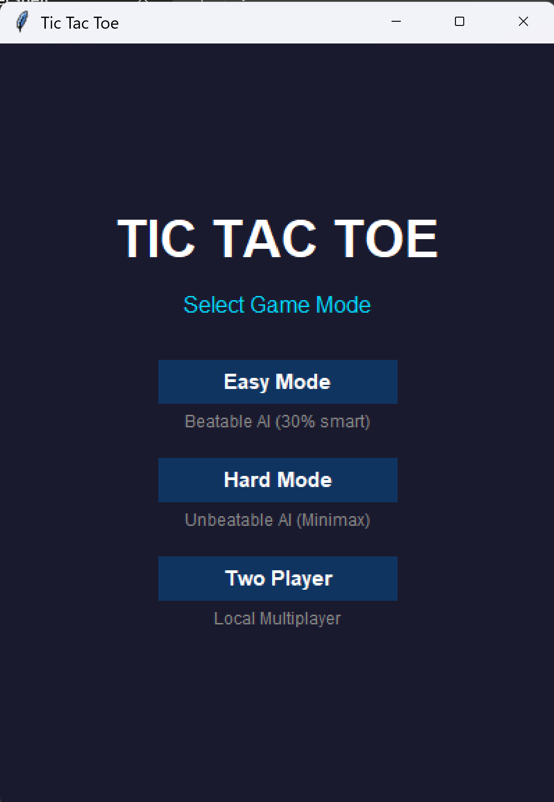
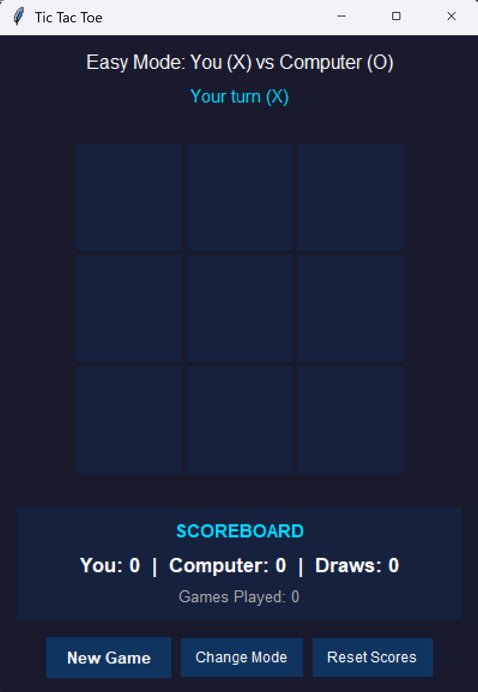

# Tic Tac Toe

[](https://github.com/luv2flysh1/TestClaude_Python/actions/workflows/ci.yml)

A Tic Tac Toe game written in Python with a modern GUI and multiple game modes.

## Features

- **Graphical Interface**: Clean, dark-themed GUI built with Tkinter
- **Easy Mode**: Play against a beatable AI that makes mistakes
- **Hard Mode**: Play against an unbeatable AI using the minimax algorithm
- **Two Player Mode**: Play locally against another person
- **Session Scoreboard**: Tracks wins, losses, and draws across multiple games
- **Command-Line Option**: Text-based interface also available

## Screenshots

| Mode Selection | Gameplay |
|:--------------:|:--------:|
|  |  |

## Requirements

- Python 3.10 or higher

## Installation

Clone the repository:

```bash
git clone https://github.com/luv2flysh1/TestClaude_Python.git
cd TestClaude_Python
```

## Usage

### GUI Version (Recommended)

Run the graphical interface:

```bash
python tic_tac_toe_gui.py
```

### Command-Line Version

Run the text-based game:

```bash
python tic_tac_toe.py
```

### How to Play (GUI)

1. Select a game mode (Easy, Hard, or Two Player)
2. Click on any empty cell to place your mark
3. Try to get three in a row!
4. After each game, click "New Game" to play again
5. Use "Change Mode" to switch game modes
6. Use "Reset Scores" to clear the scoreboard

### How to Play (Command-Line)

1. Select a game mode (Easy, Hard, or Two Player)
2. Enter position numbers (1-9) to place your mark
3. Try to get three in a row!

```
Position Reference:
 1 | 2 | 3
-----------
 4 | 5 | 6
-----------
 7 | 8 | 9
```

## Development

### Setup Development Environment

Install development dependencies:

```bash
pip install ruff mypy pytest pytest-cov
```

### Running Tests

```bash
# Run all tests
pytest

# Run with coverage
pytest --cov=. --cov-report=html
```

### Static Analysis

```bash
# Linting with Ruff
ruff check .

# Type checking with mypy
mypy tic_tac_toe.py
```

### Code Formatting

```bash
# Format code
ruff format .

# Fix linting issues
ruff check --fix .
```

## Project Structure

```
tic-tac-toe/
├── tic_tac_toe.py       # Game logic module (CLI interface)
├── tic_tac_toe_gui.py   # Tkinter GUI interface
├── test_tic_tac_toe.py  # Unit tests
├── pyproject.toml       # Project configuration & static analysis settings
├── README.md            # This file
└── .vscode/             # VSCode configuration
    ├── settings.json    # Editor settings
    ├── launch.json      # Debug configurations
    └── extensions.json  # Recommended extensions
```

## VSCode Integration

This project includes VSCode configuration for:

- Python debugging (play game, run tests)
- Ruff linting and formatting on save
- Pytest test discovery
- Recommended extensions

### Recommended Extensions

- Python (ms-python.python)
- Ruff (charliermarsh.ruff)
- Mypy Type Checker (ms-python.mypy-type-checker)

## AI Difficulty Levels

### Easy Mode
The easy AI has a 30% chance to make a smart move (block or win), otherwise it picks randomly. This makes it beatable while still providing some challenge.

### Hard Mode
The hard AI uses the minimax algorithm to evaluate all possible game states and always plays optimally. It will never lose - you can only draw or lose against it.

## Session Scoreboard

Both versions track scores across your gaming session, showing wins for each player and total draws.

### GUI Scoreboard
The GUI displays a prominent scoreboard below the game board that updates automatically after each game. Winning cells are highlighted in green, and the "New Game" button lights up to prompt you to continue.

### CLI Scoreboard
```
========================================
            SCOREBOARD
========================================
  You: 3
  Computer: 1
  Draws: 2
  Games Played: 6
========================================
```

After each game, you can:
1. **Play again** - Continue with the same game mode
2. **Change game mode** - Switch between Easy/Hard/Two Player
3. **Reset scores** - Start fresh with zero scores
4. **Quit** - Exit and see final scores

## License

MIT License
